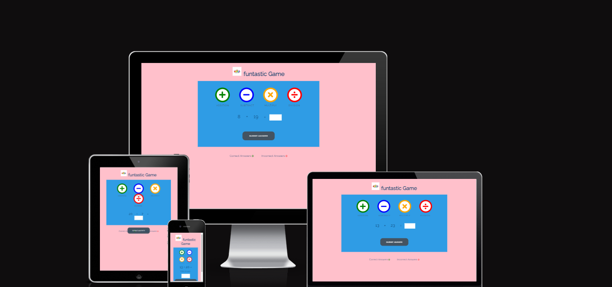
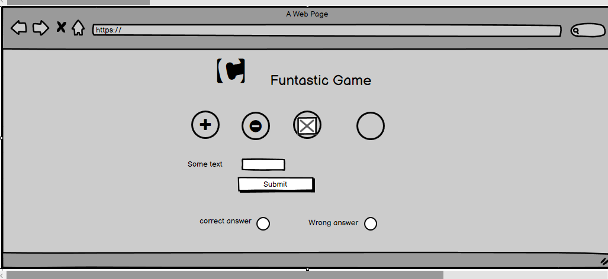
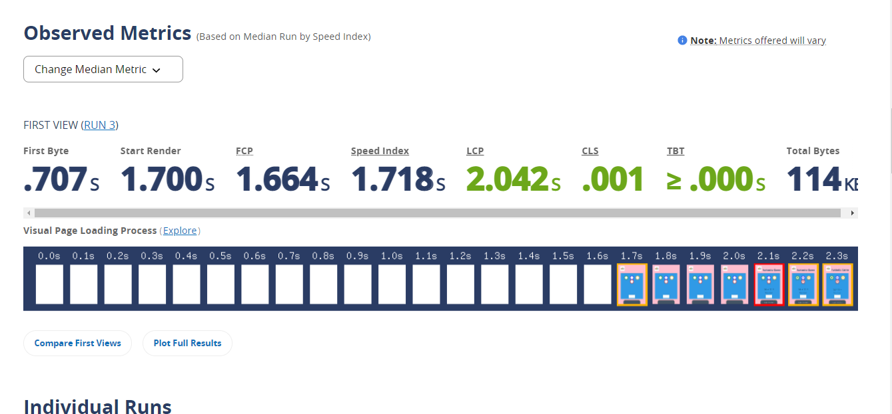
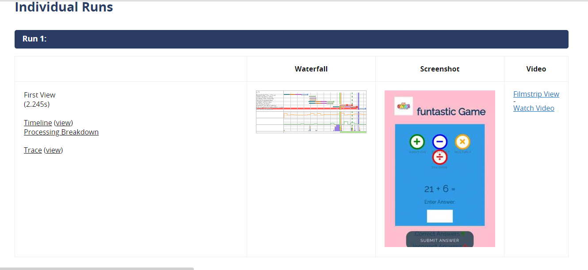
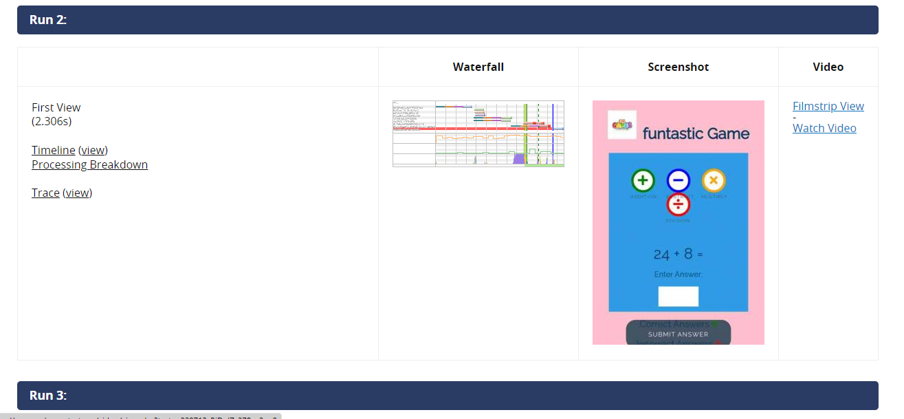
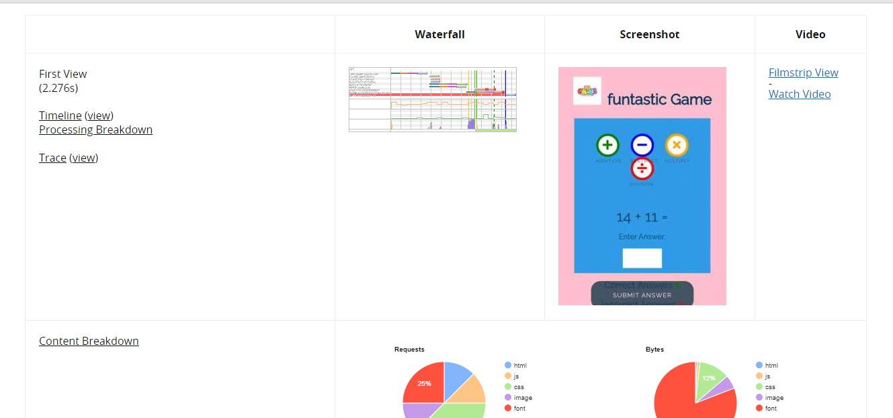

<h2>Introduction</h2>
The Funtastic Game is web based game built with HTML, CSS and JavaScript. it is mathmatical  Game for fun.

<h2>Table of Contents</h2>

<ul>
<li>User experience Design(UX)</li>
<ul>
<li>Strategy Plane</li>
<li>Scope Plan</li>
<li>Structure Plane</li>
<li>Skeleton Plane</li>
<li>Surface Plane</li>
</ul>
<li>Features</li>
<li>Future Enhancement</li>
<li>Performance Testing</li>
<li>Deployment</li>
<li>Credits</li>
</ul>
<h2>UX</h2>

The Strategy Plane
Funtastic Game is intended to be fun game for individual users to play for short periods of time.
<li>Site Goals</li>
>To provide user fun and easy game to play.
 
> To ensure the game is fully compliant and screen readers.
<li>User Experience </li>
> user friendly game and fun to play
 
> user able to play an easier and quicker way.

<h2>The Scope Plane</h2>

<li>Responsive design:</li>
The site should function correctly across the range of devices, user could use to access such as Desktop, Laptops and tablet.
 
the site should be visually stimulating and clear to the user that it is a game.

<h2>The Structure Plane</h2>

This site should be clean, elegant color layout, all ages user friendly.
 
user should be able to play game with their devices.
 
user would be able to play in mobile devices.

<h2>Skeleton Plane</h2>

<li>I used baslamic wireframe to designed this website.</li>

<ul>
<li>Surface Design</li>
<ul>
<li>Nice and attractive pink color background.</li>
<li>colorful icons with small logo.</li>
<li>final outcome of the website design is satisfactory.</li></ul></ul>

<h2>Future Enhancement</h2>

<ul>
<li>would better to use timer in future.</li>
<li>would like to use flexboxfroggy to design better layout.</li>
<li>Quiz app using javascript .</li></ul>
<h2>Performance/Testing</h2>

<ul>
<li>This pages tested in different browers such as chrome, firefox, safari and ms egde and working perfectly fine.</li>
<li>Good looking and user friendly.</li>
<li>Interactive and userfriendly site.</li>
</ul>

<h2>Deployment</h2>

<ul>
<li>This pages are deployed in git hub pages and published </li>
<li> site link : https://neerojstha.github.io/Funtastic-Game/</li>
</ul>

<h2>Credits</h2>

<ul>
<li>This pages html, css and javascript codes are inspired from love Maths project.</li>
<li>Special thanks to my mentor Rahul Lakhanpal for mentoring me during this project.</li></ul>

